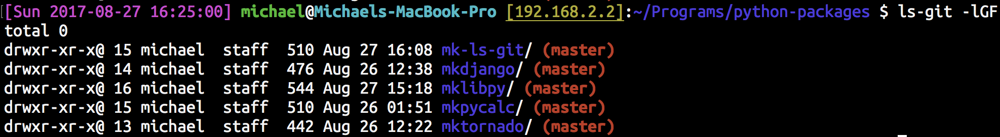

# ls-git

Author: [Michael Kim](http://michaelkim0407.com) <mkim0407@gmail.com>

***IMPORTANT*** This package has been merged into [mklibpy-bin](https://github.com/MichaelKim0407/mklibpy/tree/master/mklibpy-bin) (v0.8) and is now inactive. Please install that package instead.

## Compatibility

* Does **not** support Python 2

* Supports Python 3.5 & 3.6

    Previous Python 3 versions may be supported, but has not been tested. Please open a pull request for this README if you tested this package with another version of Python 3.

* Tested on:

    - MacOS Sierra 10.12.6 + Python 3.6.2

    - Ubuntu Linux 16.04 + Python 3.5.2

    - git-bash (Git for Windows 2.8.0) + Python 3.5.2 (See issue [#3](https://github.com/MichaelKim0407/mk-ls-git/issues/3))

## Installation

```
pip3 install mklsgit
```

## Usage

Replace `ls` with `ls-git` and pass arguments as normal.

If `-l` option is specified, git-branch will be appended if the directory is the root directory of a git repo.

If in colored mode (`--color` for GNU ls or `-G` for BSD ls), git-branch will also be colored.



## Known Issues

Please refer to Issues on GitHub.

## License

MIT
